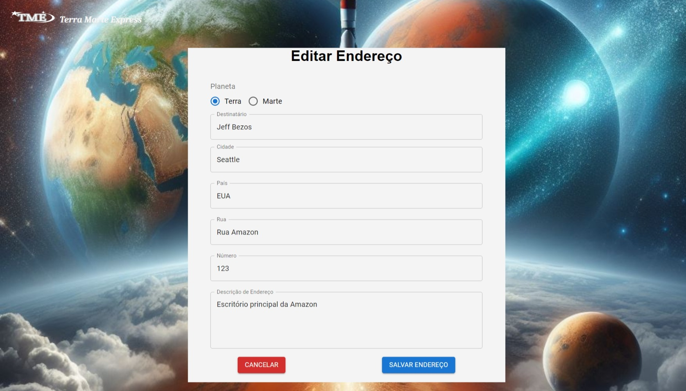
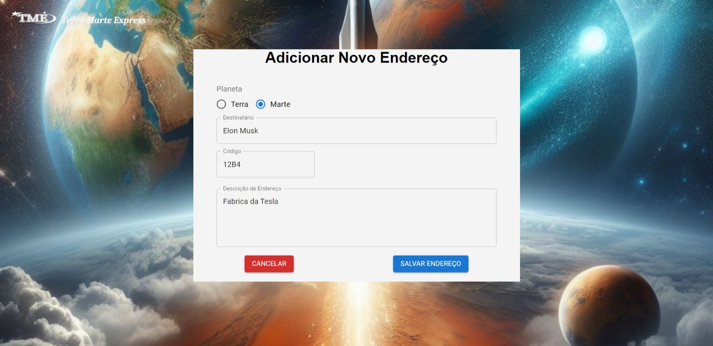

# Projeto de Sistema de Delivery Interplanetário: Terra Marte Express

## Introdução

Este projeto foi idealizado com base numa descrição de um processo seletivo, ao qual era necessário realizar apenas as telas de cadastro e edição de endereço em React, conforme descrito abaixo:

## Descrição do Desafio

Você foi selecionado para construir um sistema de delivery interplanetário!

Com a expansão da SpaceX na década de 2050 e o barateamento dos custos, a humanidade passou a exportar grande parte da produção e estoques de dispositivos eletrônicos para Marte.
Por isso, você está criando um sistema de delivery entre planetas, que automatize esse processo de entrega de Marte para a Terra e vice-versa. Saiba que, diferentemente da Terra, em Marte não existem países ou cidades, apenas lotes de quatro dígitos que representam a localização de cada fábrica ou local de armazenamento.

## Demonstração Visual

### 1. Tela de Boas Vindas
Aqui está um exemplo da tela inicial do sistema, apresentando três botões, incluindo um para cadastro e dois exemplos de endereços que podem ser editados:


---

### 2. Exemplo de Endereço na Terra
A seguir, um exemplo de endereço terrestre:



---

### 3. Exemplo de Endereço em Marte
Por fim, um exemplo de endereço em Marte, onde as localizações são representadas por lotes de quatro dígitos:



## Configuração e Execução

Para configurar e executar este projeto, siga as etapas abaixo:

1. Clone o repositório:
    ```sh
    git clone https://github.com/matheus29sm/tm-express.git
    ```
2. Navegue até o diretório do projeto:
    ```sh
    cd tm-express
    ```
3. Instale as dependências:
    ```sh
    npm install
    ```
4. Inicie o projeto:
    ```sh
    npm run dev
    ```

## Futuro Desenvolvimento

Pretendo expandir esse projeto futuramente, adicionando novas funcionalidades e melhorando outras partes para o tornar em um sistema funcional.